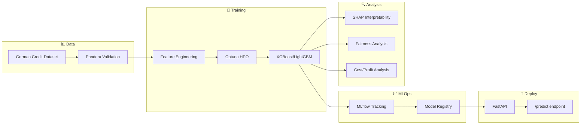
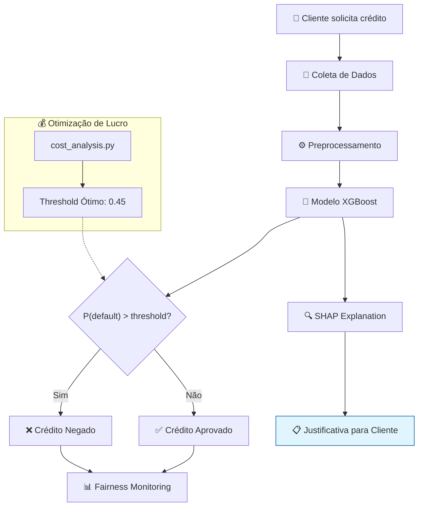
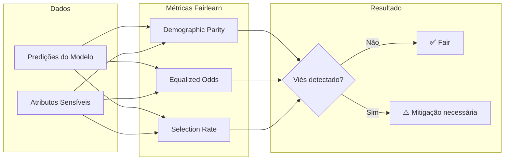

# Credit Scoring com Interpretabilidade (SHAP)


> Modelo de Credit Scoring com foco em **interpretabilidade** utilizando SHAP, **API REST** para inferência, **MLflow** para tracking de experimentos e **análise de fairness** para detecção de viés.

---

## Destaques do Projeto

| Feature | Descrição |
|---------|-----------|
| **Optuna** | Otimização Bayesiana de hiperparâmetros |
| **SHAP** | Interpretabilidade global e local |
| **FastAPI** | API REST para predições em tempo real |
| **MLflow** | Tracking de experimentos e modelos |
| **Fairlearn** | Análise de viés e equidade |
| **Pandera** | Validação de dados |
| **CI/CD** | GitHub Actions para testes automatizados |
| **TabPFN** | Foundation Model para benchmark |


---

## Contexto de Negócio

A concessão de crédito é uma das decisões mais críticas em instituições financeiras. Um modelo de **Credit Scoring** precisa não apenas ser preciso, mas também **explicável** para:

- **Compliance regulatório** (LGPD, BACEN)
- **Transparência** com clientes (direito à explicação)
- **Validação de negócio** (features fazem sentido?)
- **Detecção de viés** em variáveis sensíveis

---

## Arquitetura do Pipeline



---

## Fluxo de Decisão de Crédito



###  Zoom: Justificativa para Cliente

O módulo `explanation.py` transforma SHAP values em explicações legíveis:

```json
// Crédito NEGADO
{
  "decision": "NEGADO",
  "probability_default": 78.1,
  "risk_level": "ALTO",
  "main_factors": [
    {"feature": "Status da conta corrente", "impact": "aumenta risco"},
    {"feature": "Tipo de moradia", "impact": "aumenta risco"}
  ],
  "summary": "Crédito NEGADO. Nível de risco: ALTO. Principal fator: Status da conta corrente."
}

// Crédito APROVADO
{
  "decision": "APROVADO",
  "probability_default": 22.2,
  "risk_level": "BAIXO",
  "summary": "Crédito APROVADO! Seu perfil foi avaliado positivamente."
}
```

---

## Análise de Fairness




## Resultados

### Métricas de Performance

| Modelo | ROC-AUC | PR-AUC | F1-Score |
|--------|---------|--------|----------|
| TabPFN (Foundation) | **0.814** | **0.668** | 0.577 |
| XGBoost (Optuna) | 0.806 | 0.633 | 0.658 |
| LightGBM (Optuna) | 0.782 | 0.61 | 0.581 |

### Benchmark: Literatura

| Métrica | Nosso Modelo | Literatura* | Avaliação |
|---------|--------------|-------------|----------|
| **ROC-AUC** | 0.81 | 0.75-0.82 | Excelente |
| **PR-AUC** | 0.67 | 0.55-0.70 | Muito bom |
| **F1-Score** | 0.66 | 0.55-0.65 | Acima da média |

*Valores baseados em estudos com German Credit Dataset (UCI).

> **Interpretação**: PR-AUC de 0.67 é 2.2x melhor que o baseline aleatório (0.30), indicando boa capacidade preditiva para a classe minoritária.

### Por que múltiplas métricas?

| Métrica | O que mede | Quando usar |
|---------|-----------|-------------|
| **ROC-AUC** | Capacidade discriminativa geral | Dataset moderadamente desbalanceado |
| **PR-AUC** | Precision-Recall trade-off | Quando classe positiva é rara |
| **F1-Score** | Equilíbrio precision/recall | Decisões com threshold fixo |

### Análise de Custo (Cost-Sensitive)

Em credit scoring, os custos são **assimétricos**:

| Erro | Custo típico | Impacto |
|------|--------------|---------|
| **FN** (emprestar para mau) | -R$1000 | Perde o principal |
| **FP** (negar para bom) | -R$200 | Perde margem |

O módulo `cost_analysis.py` encontra o **threshold ótimo** que maximiza lucro.

---

## Foundation Models Comparison

Este projeto explora **Foundation Models** para dados tabulares, comparando performance vs interpretabilidade.

### Resultados

| Modelo | ROC-AUC | PR-AUC | Interpretabilidade |
|--------|---------|--------|-------------------|
| **TabPFN** | **0.814** | **0.668** | Limitada |
| XGBoost + SHAP | 0.806 | 0.633 | Excelente |

### Trade-off: Performance vs Explicabilidade

> **Importante**: Em credit scoring, a **explicabilidade é requisito regulatório** (LGPD, BACEN).

| Cenário | Modelo Recomendado |
|---------|-------------------|
| Produção (regulado) | XGBoost + SHAP |
| Prototipo/PoC | TabPFN |

Para detalhes, veja: `notebooks/05_foundation_models.ipynb`


## Instalação

```bash
# Clone o repositório
git clone https://github.com/seu-usuario/credit-scoring-shap.git
cd credit-scoring-shap

# Instale as dependências
poetry install

# Ative o ambiente
poetry shell
```

---

## Uso

### Treinar Modelo

```bash
# Com otimização Optuna (recomendado)
make train

# Treinamento rápido (sem Optuna)
make train-quick
```

### API REST

```bash
# Iniciar servidor
make api

# Testar endpoint
curl -X POST "http://localhost:8000/predict" \
  -H "Content-Type: application/json" \
  -d '{"duration": 24, "credit_amount": 5000, ...}'
```

Após iniciar, acesse a documentação interativa (Swagger UI) em: `http://localhost:8000/docs`

### MLflow Tracking

```bash
# Iniciar UI do MLflow
make mlflow

# Acessar em: http://localhost:5000
```

### Análise de Fairness

```bash
# Executar notebook de fairness
make fairness
```

### Notebooks

```bash
poetry run jupyter notebook

# Ordem recomendada:
# 1. 01_eda.ipynb - Análise exploratória
# 2. 02_modeling.ipynb - Modelagem com Optuna
# 3. 03_interpretability.ipynb - Análise SHAP
# 4. 04_fairness.ipynb - Detecção de viés
# 5. 05_foundation_models.ipynb - TabPFN comparison
```

---

## Estrutura do Projeto

```
credit-scoring-shap/
├── .github/workflows/      # CI/CD
│   └── ci.yml
├── src/credit_scoring/
│   ├── api/                # FastAPI endpoints
│   ├── data/               # Loaders + validação
│   ├── fairness/           # Análise de viés
│   ├── features/           # Feature engineering
│   ├── interpretability/   # SHAP analysis
│   ├── models/             # Training + evaluation
│   └── tracking/           # MLflow integration
├── notebooks/
│   ├── 01_eda.ipynb
│   ├── 02_modeling.ipynb
│   ├── 03_interpretability.ipynb
│   └── 04_fairness.ipynb
├── tests/
├── models/                 # Modelos salvos
├── reports/                # Métricas e figuras
├── pyproject.toml
└── Makefile
```

---

## Tecnologias

| Categoria | Ferramentas |
|-----------|-------------|
| **ML** | scikit-learn, XGBoost, LightGBM |
| **Otimização** | Optuna |
| **Interpretabilidade** | SHAP |
| **Fairness** | Fairlearn |
| **API** | FastAPI, Uvicorn |
| **Tracking** | MLflow |
| **Validação** | Pandera |
| **Visualização** | Matplotlib, Seaborn, Plotly |
| **Qualidade** | Black, Flake8, isort, mypy, pre-commit |
| **CI/CD** | GitHub Actions |
| **Ambiente** | Poetry |

---

## Comandos Makefile

| Comando | Descrição |
|---------|-----------|
| `make install` | Instalar dependências |
| `make train` | Treinar com Optuna |
| `make train-quick` | Treinar sem Optuna |
| `make api` | Iniciar API |
| `make mlflow` | Iniciar MLflow UI |
| `make fairness` | Executar análise de fairness |
| `make test` | Rodar testes |
| `make format` | Formatar código |
| `make lint` | Verificar linting |

---

## Referências

- [German Credit Dataset - UCI](https://archive.ics.uci.edu/dataset/144/statlog+german+credit+data)
- [SHAP Documentation](https://shap.readthedocs.io/)
- [Optuna Documentation](https://optuna.readthedocs.io/)
- [FastAPI Documentation](https://fastapi.tiangolo.com/)
- [MLflow Documentation](https://mlflow.org/docs/latest/)
- [Fairlearn Documentation](https://fairlearn.org/)

---

## Licença

Este projeto está sob a licença MIT.

---

## Autor

**Jorge Silva Pereira** - Analista de Dados

[](https://www.linkedin.com/in/jorgepereira-/)
[](https://github.com/JorgeSPereira)
